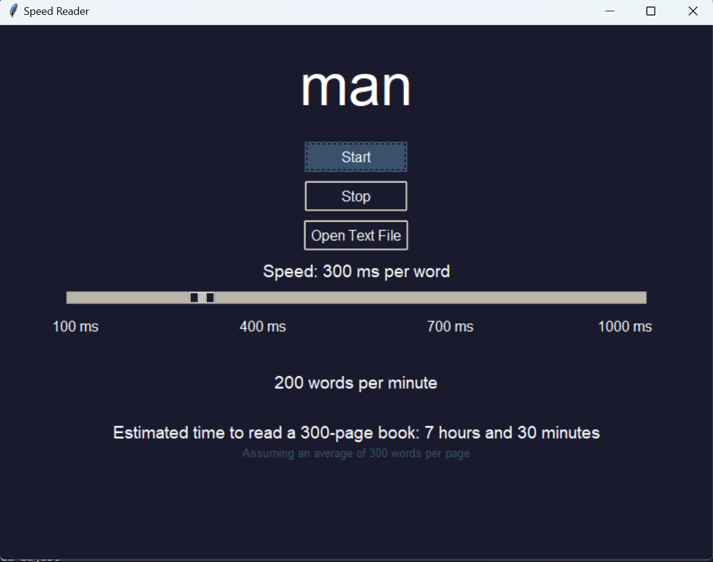

# Speed Reader Application

This Speed Reader application helps you increase your reading speed and comprehension by displaying text word-by-word at a speed you can control. The application allows you to load your own text files or use a default text provided within the project.

## Features

- Adjustable reading speed
- Start and stop controls
- Load custom text files
- Displays words per minute (WPM) and estimated time to read a 300-page book
- Dark mode user interface

## Requirements

- Python 3.x
- Tkinter (comes pre-installed with Python)
- `default_text.txt` file (included in the project)

## Installation

1. **Clone the repository:**
    ```bash
    git clone https://github.com/yourusername/speed-reader.git
    cd speed-reader
    ```

2. **Ensure you have Python 3.x installed.**

3. **Install required libraries:**
    - Tkinter is included with Python, so no additional installation is required.

## Usage

1. **Run the application:**
    ```bash
    python speed_reader.py
    ```

2. **Use the application:**
    - Click `Start` to begin reading the default text provided in `default_text.txt`.
    - Adjust the reading speed using the slider or the incremental speed buttons.
    - Click `Stop` to pause the reading.
    - Click `Open Text File` to load a custom text file from your device.

3. **Modifying the Default Text:**
    - To change the default text, edit the `default_text.txt` file included in the project directory.

## Screenshots



## License

This project is licensed under the MIT License. See the `LICENSE` file for details.

## Contributing

1. Fork the repository.
2. Create a new branch (`git checkout -b feature-branch`).
3. Make your changes.
4. Commit your changes (`git commit -am 'Add new feature'`).
5. Push to the branch (`git push origin feature-branch`).
6. Create a new Pull Request.

## Acknowledgments

- The initial text used in the default text file is from "Pride and Prejudice" by Jane Austen, which is in the public domain.


